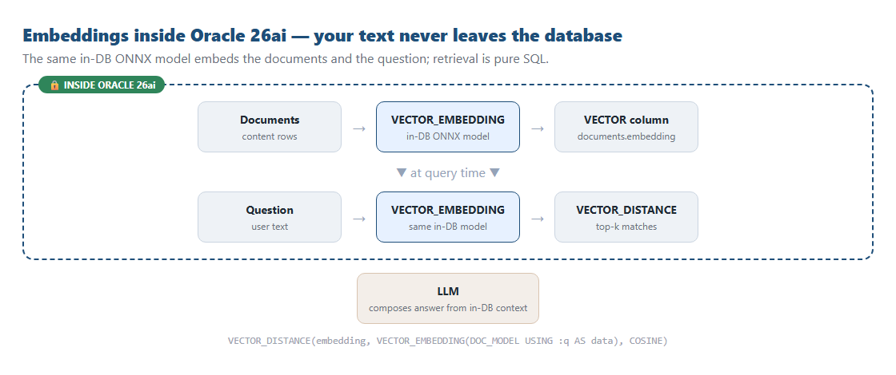
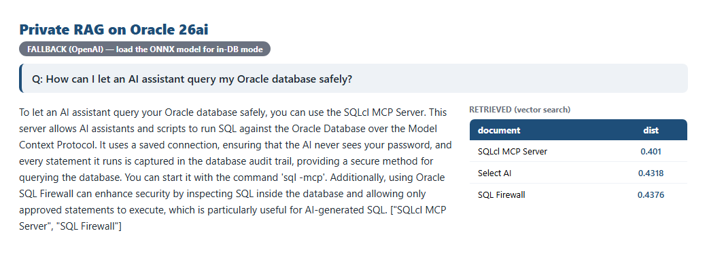

# Your Documents Never Leave the Database: Private RAG on Oracle 26ai

*Retrieval-augmented Q&A where the embeddings happen inside Oracle 26ai — no text shipped to an external API.*

---

Every RAG tutorial starts the same way: take your documents, send them to an embedding API, get vectors back. For a hobby project that's fine. For **private or regulated data**, shipping every document (and every user question) to a third-party endpoint is exactly the thing your security team won't sign off on.

Oracle 26ai offers a different path: load an embedding model *into the database* and generate the vectors **where the data already lives**. The text never leaves Oracle to be embedded.

## The whole pipeline, inside the database


*The same in-DB model embeds the documents and the query; retrieval is plain SQL.*

## How it works

**1. Load an embedding model into Oracle (once).** Oracle ships a prebuilt ONNX model you import with `DBMS_VECTOR.LOAD_ONNX_MODEL`.

**2. Embed the documents in place** — no data leaves the DB:

```sql
UPDATE documents
   SET embedding = VECTOR_EMBEDDING(DOC_MODEL USING content AS data);
```

**3. Embed the question in the DB too, and retrieve** — the user's text is embedded inside Oracle as part of the same query:

```sql
SELECT title,
       VECTOR_DISTANCE(embedding,
          VECTOR_EMBEDDING(DOC_MODEL USING :q AS data), COSINE) AS distance,
       content
FROM   documents
ORDER  BY distance
FETCH  APPROX FIRST 3 ROWS ONLY;
```

## The result

Ask a question, get an answer grounded in the retrieved clauses — with the matched documents and their distances right there:


*A grounded answer plus the retrieved documents and distances. (Badge shows the embedding mode — flip to in-DB by loading the model.)*

## A practical note (and an honest one)

The demo **auto-detects** the in-DB model: if it's loaded, documents and queries are embedded inside Oracle; if not, it falls back to a client-side embedding API so you can try it immediately. Loading the ONNX model is a one-time admin step (it needs a credential to fetch the model), after which everything runs zero-external for embeddings and retrieval.

One scoping point: *embeddings and retrieval* are fully in-database. The final answer wording is still produced by an LLM from the retrieved context — swap in an in-database generation path (e.g. Select AI) if you want generation to stay in Oracle too.

## Why it matters

- **Data residency.** Sensitive documents are embedded where they live — nothing is shipped out to be vectorized.
- **Fewer moving parts.** No separate embedding service to secure, scale, rate-limit, or pay per call.
- **It's just SQL.** `VECTOR_EMBEDDING` and `VECTOR_DISTANCE` in one statement — embed, search, done.

The agent reaches the database through the **SQLcl MCP Server**, so even orchestration uses a saved connection and an audited path.

---

*About the author: **Prashant Khadayate** is an **Oracle ACE** focused on the Oracle AI Database (26ai), AI Vector Search, and the SQLcl MCP Server. Connect on [LinkedIn](https://www.linkedin.com/in/prashant-khadayate-1a8b0b97/) for more hands-on Oracle AI experiments.*

> A learning demo.
